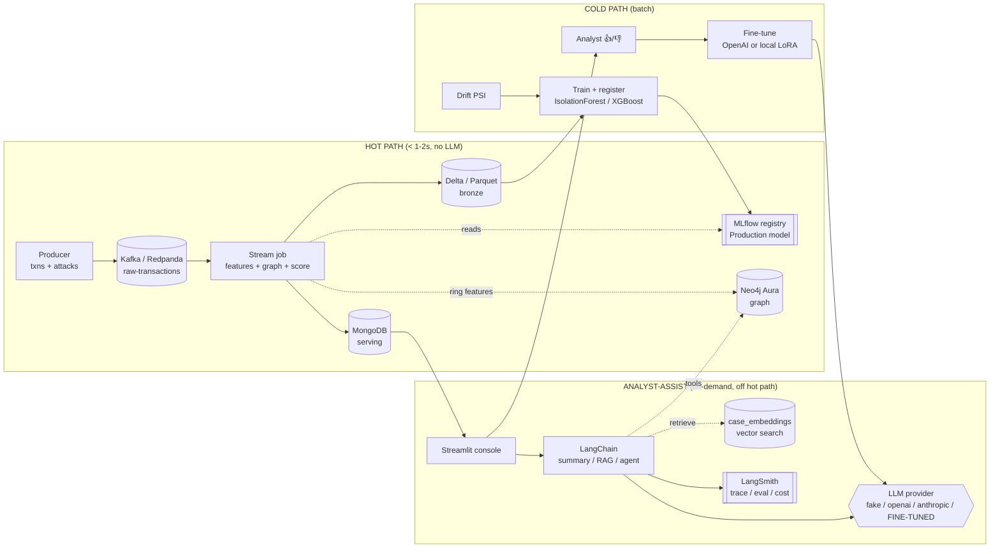

# Real-Time Fraud & Anomaly Detection Platform

A streaming, explainable, **graph-aware** fraud detection system with a
human-in-the-loop review workflow and full **MLOps + LLMOps** observability.
Runs locally with zero paid cloud dependencies; adding keys transparently
upgrades the LLM, tracing, graph and vector paths.

> Graph store: **Neo4j Aura** (managed cloud cluster).
> Analyst LLM: **LangChain**-orchestrated, with an optional **fine-tuned model**
> trained from analyst 👍/👎 feedback.

---

## Architecture



Three planes, each with its own SLA:

- **Hot path** (`< 1–2s`): Kafka → stream → features + graph + ML score → Mongo. Deterministic, **no LLM inline**.
- **Analyst-assist** (on demand): LangChain summary/RAG/agent, traced by LangSmith. Includes a **fine-tuned analyst LLM** in the loop.
- **Cold path** (batch): lakehouse history, drift detection, retraining + model promotion (no stream restart), and LLM fine-tuning from feedback.

---

## Quickstart

```bash
# 0. Python deps
make install                 # pip install -e ".[dev]"

# 1. Configure secrets (Neo4j Aura is required for the graph layer)
cp .env.example .env         # then paste values — see "Configuration" below

# 2. Start local infra (Redpanda + MongoDB + MLflow)
make up

# 3. Seed topics, Mongo indexes, Neo4j rings, case embeddings
make seed

# 4. Train + register the first model (MLflow)
make train

# 5. Run the pipeline (each in its own terminal)
make producer                # synthetic txns + attacks -> Kafka
make stream                  # Kafka -> features -> score -> Mongo
make dashboard               # http://localhost:8501
```

Then open the dashboard, click a flagged case → see SHAP + graph/ring info →
**"Explain this case"** for a grounded, cited LLM summary → 👍/👎 to feed the
fine-tune set. Use the **attack injector** to trigger detections live.

---

## Configuration (what you need to paste)

All secrets live in **`.env`** (copy from `.env.example`). Nothing is hard-coded.

| Key | Required? | Where to get it |
|---|---|---|
| `NEO4J_URI`, `NEO4J_PASSWORD` | **Yes** (graph layer) | [Neo4j Aura console](https://console.neo4j.io) → create instance → download credentials |
| `MONGO_URI` | No (local default) | Local docker default works; or MongoDB Atlas SRV URI |
| `KAFKA_BOOTSTRAP_SERVERS` | No (local default) | Local Redpanda default works; or Confluent Cloud |
| `OPENAI_API_KEY` / `ANTHROPIC_API_KEY` | Optional | Enables real LLM summaries (else offline FakeListLLM) |
| `LANGCHAIN_API_KEY` + `LANGCHAIN_TRACING_V2=true` | Optional | Enables LangSmith tracing/eval |
| `FINETUNED_MODEL_ID` + `LLM_PROVIDER=finetuned` | Optional | Set after running `make finetune` |

Everything else has a safe local default. See `.env.example` for the full,
commented list.

### Minimum to run the graph features + rings
Paste your Aura URI + password into `.env`:
```
NEO4J_URI=neo4j+s://xxxx.databases.neo4j.io
NEO4J_PASSWORD=your-generated-password
```

---

## The fine-tuned LLM loop (with LangChain kept)

LangChain remains the orchestration layer for **all** summaries/agents. A
fine-tuned model plugs in behind the same interface:

1. Analysts click 👍/👎 on summaries in the dashboard → feedback is persisted
   (`data/feedback/analyst_feedback.jsonl`) and to LangSmith when enabled.
2. `make finetune` exports the thumbs-up, grounded summaries to a chat JSONL
   dataset and trains:
   - **OpenAI fine-tuning** if `OPENAI_API_KEY` is set → prints an `ft:gpt-...` id.
   - **Local LoRA/PEFT** fallback (`pip install -e ".[finetune]"`) on a small base
     model → writes an adapter to `models/finetuned`.
3. Serve it by setting `LLM_PROVIDER=finetuned` and `FINETUNED_MODEL_ID=<id or path>`.
   The same LangChain summary/RAG/agent chains now use the fine-tuned model.

```bash
make finetune                # export feedback -> fine-tune -> print how to serve
```

---

## Common tasks (`make help`)

| Command | Description |
|---|---|
| `make up` / `make down` | Start / stop local infra |
| `make seed` | Topics + Mongo indexes + Neo4j rings + case embeddings |
| `make producer` | Synthetic transaction + attack generator |
| `make stream` | Hot-path scoring consumer |
| `make dashboard` | Streamlit console |
| `make train` | Train + register a model (promotes if it beats incumbent) |
| `make drift` | PSI drift check → triggers retrain if drifted |
| `make graph-load` | Recompute Neo4j communities / rings |
| `make finetune` | Export feedback → fine-tune the analyst LLM |
| `make eval-llm` | LLM evaluation harness (faithfulness / relevance) |
| `make chaos` | Kill + recover the consumer to prove no-loss recovery |
| `make test` / `make lint` / `make typecheck` | Quality gates |

---

## Repository layout

```
config/settings.py         one typed source of config (pydantic-settings)
src/fraud/
  schemas.py               pydantic data contracts
  producer/                synthetic generator + Kafka utils + topic admin
  stream/                  features (pure) + graph_features + scorer + job + chaos
  ml/                      train + drift + explain (SHAP) + synthetic data
  graph/loader.py          Neo4j Aura ETL + community detection + ring lookups
  serving/mongo.py         idempotent upserts, indexes, vector search
  assist/                  LangChain: llm, prompts, retriever, chains, agent,
                           tracing (LangSmith), finetune, eval
  dashboard/app.py         Streamlit console
tests/                     features, schemas, scorer, chains (mocked LLM), finetune
docs/                      architecture + runbook
```

See [docs/architecture.md](docs/architecture.md) and [docs/runbook.md](docs/runbook.md).

---

## Design principles

1. **Separate hot & cold** — fast decisions (Mongo) vs heavy learning (lakehouse) on different paths/stores.
2. **Plan for drift** — PSI + score-distribution drift trigger retraining; challengers only promote if they beat production.
3. **LLM off the hot path** — the model never blocks a scoring decision; it explains flagged cases on demand.
4. **Grounded LLM** — summaries cite retrieved case ids and only assert what SHAP/retrieval support.
5. **Idempotent & replayable** — all writes upsert on natural keys; Kafka can be safely replayed.
